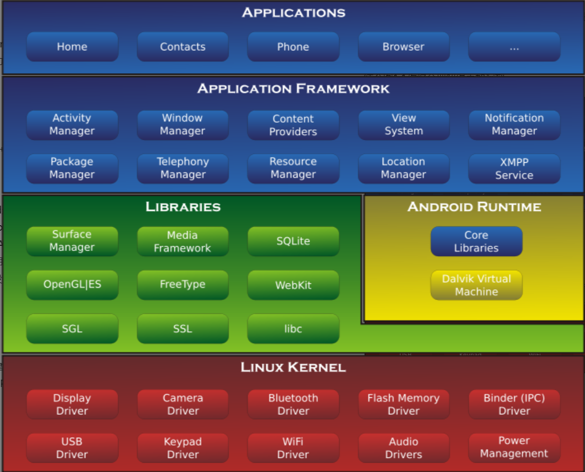

[[阅读笔记]]
Android大致可以分为4层架构：Linux内核层、系统运行库层、应用框架层和应用层。

1. Android系统是基于Linux内核的，这一层为Android设备的各种硬件提供了底层的驱动，如显示驱动、音频驱动、照相机驱动、蓝牙驱动、WI-FI驱动、电源管理等。

2. 系统运行库层。这一层通过一些C/C++库为Android系统提供了主要的特性支持。如SQLite库提供了数据库的支持，OpenGL/ES库提供了3D绘图的支持，Webkit库提供了浏览器内核的支持等。

   这一层还有Android运行时库，它提供了一些核心库，允许开发者使用Java语言来编写Andoid应用。另外，Android运行时库还包含了Dalvik

   虚拟机（5.0系统之后改为ART运行环境），它使得每一个Android应用都能运行在独立的进程中，并且拥有一个自己的虚拟机实例。相较于Java虚拟机，Dalvik和ART都是为移动设备定制的，它针对手机内存、CPU性能等情况都做了优化处理。

3. 应用框架层。应用框架层主要提供了构建应用程序时可能用到的各种API，Android自带的一些核心应用就是使用这些API完成的。

4. 应用层。所有安装在手机上的应用程序都是属于这一层的，比如系统自带的联系人、短信等程序，或者是从Google Play上下载的小游戏， 当然还包括自己开发的程序。
   

