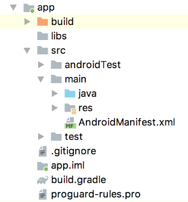

 Android模式下的项目结构 

Project模式下的安卓项目结构

## Project模式下的项目结构
1.  `.gradle`和`.idea`
    这两个目录下放置的都是Android Studio自动生成的一些文件，我们无须关心，也不需要去手动编辑。
2.  `app`
  项目中的代码、资源等内容都是放置在这个目录下的，我们后面的开发工作也是基本在这个目录下进行的。
3.  `build`
  这个目录主要包含了一些在编译时自动生成的文件。
4.  `gradle`
  这个目录下包含了gradle wrapper的配置文件，使用gradle wrapper的方式不需要提前把gradle下载好，而是会自动根据本地的缓存情况决定是否需要联网下载gradle。Andoid Studio默认就是启用gradlewrapper方式的，如果需要更改成离线模式，可以点击Android Studio导航栏->File->Settings->Build,Execution,Deployment->Gradle，进行配置更改。
5.  `.gitignore`
  这个文件是用来将指定的目录或者文件排除在版本控制之外的。
6.  `build.gradle`
  这是项目全局的gradle构建脚本，通常这个文件的内容是不需要修改的。
7.  `gradle.properties`
  这个文件是全局的gradle配置文件，在这里配置的属性将会影响到项目中所有的gradle编译脚本。
8.  `gradlew`和`gradlew.bat`
  这两个文件是用来在命令行界面中执行gradle命令的，其中gradlew是在Linux或Mac系统中使用的，gradlew.bat是在windows系统中使用的。
9.  `HelloWorld.iml`
  `iml`文件是所有IntelliJ IDEA项目都会自动生成的一个文件（Android Studio是基于InterlliJ IDEA开发的），用于标识这是一个IntelliJ IDEA项目，我们不需要修改这个文件中的任何内容。
10.  `local.properties`
     这个文件用于指定本机中的 Android SDK路径，通常内容是自动生成的，我们并不需要修改。除非本机中的Android SDK位置发生了变化，那么就将这个文件中的路径改成新的位置即可。
11.  `settings.gradle`
     这个文件用于指定项目中所有引入的模块。通常情况下，模块的引入都是自动完成的，需要我们手动修改这个文件的场景可能比较少。

app文件结构

