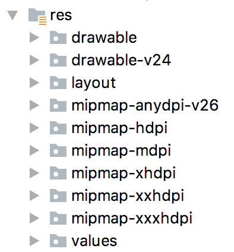

[阅读笔记](./阅读笔记.md)

 Android模式下的项目结构 

Project模式下的安卓项目结构

## Project模式下的项目结构
1.  `.gradle`和`.idea`
    这两个目录下放置的都是Android Studio自动生成的一些文件，我们无须关心，也不需要去手动编辑。
2.  `app`
  项目中的代码、资源等内容都是放置在这个目录下的，我们后面的开发工作也是基本在这个目录下进行的。
3.  `build`
  这个目录主要包含了一些在编译时自动生成的文件。
4.  `gradle`
  这个目录下包含了gradle wrapper的配置文件，使用gradle wrapper的方式不需要提前把gradle下载好，而是会自动根据本地的缓存情况决定是否需要联网下载gradle。Andoid Studio默认就是启用gradlewrapper方式的，如果需要更改成离线模式，可以点击Android Studio导航栏->File->Settings->Build,Execution,Deployment->Gradle，进行配置更改。
5.  `.gitignore`
  这个文件是用来将指定的目录或者文件排除在版本控制之外的。
6.  `build.gradle`
  这是项目全局的gradle构建脚本，通常这个文件的内容是不需要修改的。
7.  `gradle.properties`
  这个文件是全局的gradle配置文件，在这里配置的属性将会影响到项目中所有的gradle编译脚本。
8.  `gradlew`和`gradlew.bat`
  这两个文件是用来在命令行界面中执行gradle命令的，其中gradlew是在Linux或Mac系统中使用的，gradlew.bat是在windows系统中使用的。
9.  `HelloWorld.iml`
  `iml`文件是所有IntelliJ IDEA项目都会自动生成的一个文件（Android Studio是基于InterlliJ IDEA开发的），用于标识这是一个IntelliJ IDEA项目，我们不需要修改这个文件中的任何内容。
10.  `local.properties`
     这个文件用于指定本机中的 Android SDK路径，通常内容是自动生成的，我们并不需要修改。除非本机中的Android SDK位置发生了变化，那么就将这个文件中的路径改成新的位置即可。
11.  `settings.gradle`
     这个文件用于指定项目中所有引入的模块。通常情况下，模块的引入都是自动完成的，需要我们手动修改这个文件的场景可能比较少。

app文件结构

## app目录下的结构
1. `build`
这个目录与外层的build目录类似，也包含了一些在编译时自动生成的文件，不过它里面的内容会更加复杂，我们不需要过多关心。
2. `libs`
如果项目中用到了第三方jar包，就需要把这些jar包都放在libs目录下，放在这个目录下的jar包会被自动添加到项目的构建路径中。
3. `androidTest`
此处是用来编写Android Test测试用例的，可以对项目进行一些自动化测试。
4. `java`
毫无疑问，`java`目录是放置我们所有java代码的地方（`kotlin`代码也会放在这里），展开该目录，可以看到系统自动生成的一个MainActivity文件。
5. `res`
这个目录包含了 项目使用到的所有图片、布局、字符串等资源。图片放在drawable目录下，布局文件放在layout目录下，字符串放在value目录下。
6. `AndroidMainfest.xml`
这是整个Android项目的配置文件，在程序中定义的四大组件都需要在这个文件里注册，另外还可以在这个文件里给应用程序添加权限声明。
7. `test`
此处是用来编写Unit Test测试用例的，是对项目进行自动化测试的另一种方式。
8. `.gitignore`
这个文件用于将app模块内指定的目录或文件排除在版本控制之外，作用和外层的`.gitignore`文件类似。
9. `app.iml`
IntelliJ IDEA项目自动生成的文件，我们不需要关心或者修改这个文件里的内容。
10. `build.gradle`
这是app模块的gradle构建脚本，这个文件中会指定很多项目构建相关的配置。
11. `proguard-rules.pro`
这个文件用于指定项目代码的混淆规则，当代码开发完成后打包成安装包文件，如果不希望代码被别人破解，通常会将代码进行混淆，从而让破解者难以阅读。

## res目录下的结构

res目录下的结构

- `drawable`开头的目录都是用来放图片的。
- `mipmap`开头的目录都是用来放应用图标的。
- `values`开头的目录都是放字符串、样式、颜色等配置的。
- `layout`开头的目录都是用来放布局文件的。

**res目录下的资源可以通过两种方式来调用**
- 在代码中通过`R.string.app_name`可以获得字符串的引用
- 在xml中通过`@string/app_name`可以获得该字符串的引用
string部分可以根据引用的具体资源类型替换。

## 详解`build.gradle`文件

Android Studio是采用Gradle来构建项目的。Gradle是一个非常先进的项目构建工具，它采用了一种基于Groovy的领域特定语言（DSL）来进行项目设置，摒弃了传统基于XML的各种繁琐配置。
