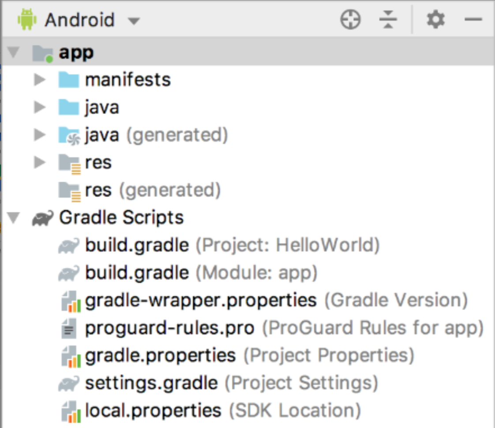

 Android模式下的项目结构 

Project模式下的安卓项目结构

## Project模式下的项目结构
1.  `.gradle`和`.idea`
这两个目录下放置的都是Android Studio自动生成的一些文件，我们无须关心，也不需要去手动编辑。
2. `app`
项目中的代码、资源等内容都是放置在这个目录下的，我们后面的开发工作也是基本在这个目录下进行的。
3. `build`
这个目录主要包含了一些在编译时自动生成的文件。
4. `gradle`
这个目录下包含了gradle wrapper的配置文件，使用gradle wrapper的方式不需要提前把gradle下载好